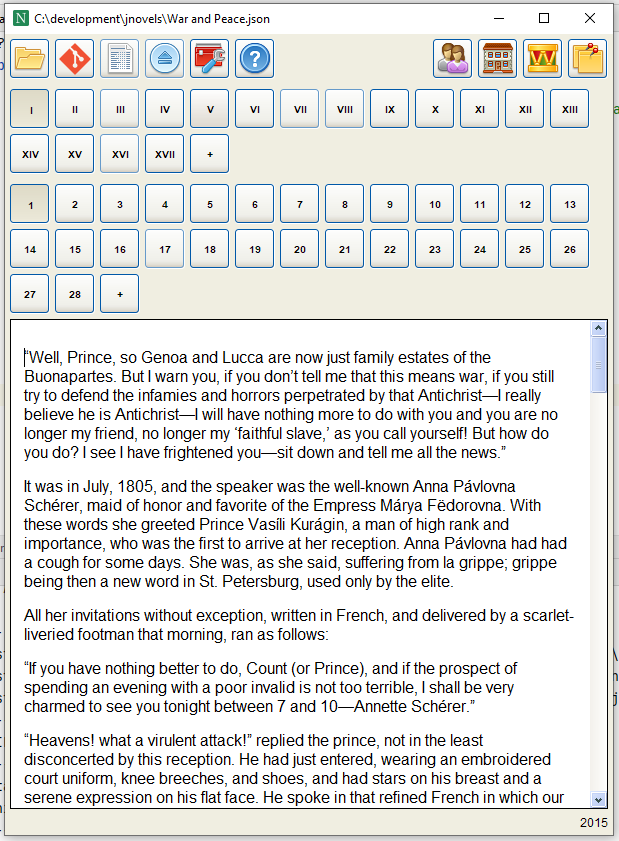
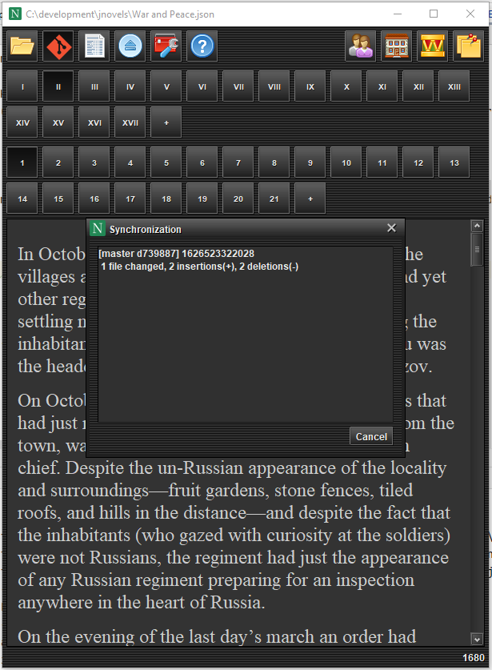
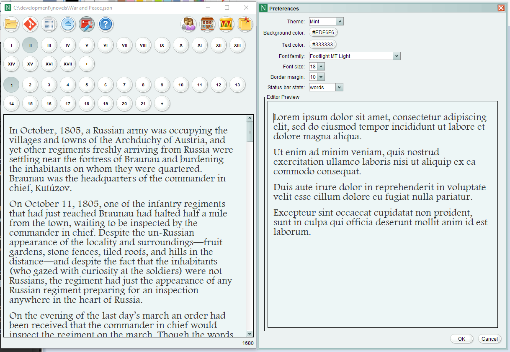

# About

JNovelist is a text management system integrated with **Git**.

You can use it to write a novel such as ["War and Peace" by Leo Tolstoy](https://en.wikipedia.org/wiki/War_and_Peace).

I specifically used this huge text to test the performance. At some point I even had to completely rewrite the UI.

# Features

- open/close a project file (json)
- to create a new project use "Open" and type the name of the file
- export (aggregates the novel text in one window, ready for copy-and-paste)
- Git sync (runs git add, git push in a synchronization dialog)
- preferences (change Look-and-feel, background color, text color, font, font size, border margin)
- additional information (extras that are not part of the novel text, includes: characters, places, artifacts, notes)
- novel consists of parts and chapters (use the add button '+' and right-click to add/remove chapters and parts)

# Git Integration

There is no authentication, no clone, no conflict resolution. All of this should be set up and managed using another
program or command line.

JNovelist attempts to run **git add** and **git push**. If it fails (eg. there is no Internet connection) then the
synchronization window is left open allowing you to check the error message and fix the problem.

# Preferences

Using preferences you can select from a number of look-and-feels and set up the text editor the way you like it (almost)
.

# Requirements

Java version no less than **1.8** should be installed on your desktop. I haven't tested with other versions though.

Windows users: use **JNovelist.exe** like I do. You can drag it to the taskbar.

Linux/iOS: use the single jar file that comes with all dependencies. You only need java installed.

# License

No license. Public domain.